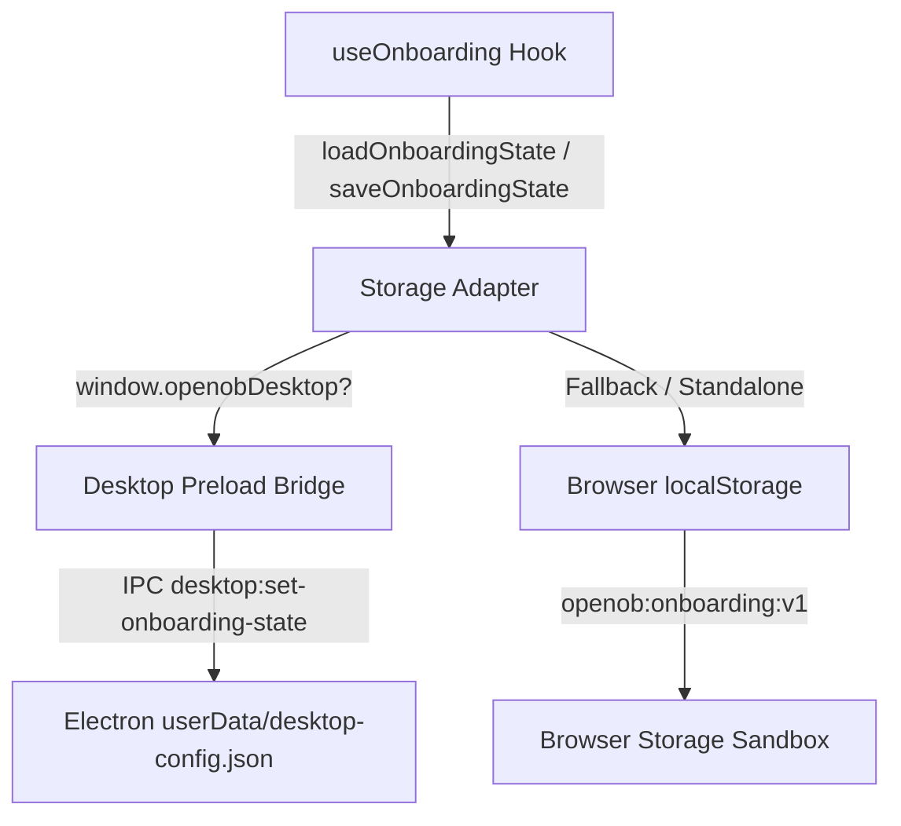

# OpenOb Onboarding & Learn Center Architecture

This document describes the design, state management, UI spotlight engine, and persistence contracts for OpenOb's Guided Onboarding and Learn Center subsystems.

---

## 1. Core Principles & Non-Negotiables

1. **Zero Vault Mutation**: Guided onboarding and tutorial chapters NEVER mutate user notes, create demo files, write frontmatter, or alter `.openob` configuration simply to demonstrate a feature.
2. **Device/UI Level Persistence**: Tutorial progress is an application/device preference. It is strictly excluded from canonical Markdown content, Git vaults, and workspace indices.
3. **Always Skippable & Replayable**: First-run onboarding can be skipped immediately with a single click or `Escape`. All chapters remain permanently replayable from **More (···) → Learn OpenOb**.
4. **Missing-Target Resilience**: If a target UI element is absent or collapsed, the tour engine attempts a non-destructive prepare action (e.g. expanding the sidebar), waits briefly, and if still unavailable, gracefully displays the step centered without throwing or halting the application.
5. **No AI Provider Dependency**: AI tutorial chapters explain local (Ollama/LM Studio) and cloud (BYOK) configurations conceptually without making external network calls or requiring pre-configured API keys.

---

## 2. Subsystem Structure

```
apps/web/src/
├── onboarding/
│   ├── types.ts          # Core interfaces (OnboardingState, TourStep, TourChapter)
│   ├── targets.ts        # DOM selector registry for data-tour attributes
│   ├── chapters.ts       # 13-step Quick Tour & 11 Learn Center chapters
│   ├── storage.ts        # Dual-mode persistence adapter (Electron bridge & localStorage)
│   └── useOnboarding.ts  # State machine hook, step transitions, prepare actions
└── components/onboarding/
    ├── WelcomeModal.tsx          # First-run welcome modal with Saint Jackass mark
    ├── TourOverlay.tsx           # Spotlight cutout overlay & anchored guidance card
    ├── LearnCenterModal.tsx      # Comprehensive Learn Center chapter catalog & progress
    └── KeyboardShortcutsModal.tsx# Keyboard shortcuts cheat sheet
```

---

## 3. Data Contracts & State Model

### State Definition (`apps/web/src/onboarding/types.ts`)

```ts
export const TUTORIAL_VERSION = 1;

export interface OnboardingState {
  version: number;
  dismissedFirstRun: boolean;
  quickTourCompleted: boolean;
  completedChapters: string[];
}

export const DEFAULT_ONBOARDING_STATE: OnboardingState = {
  version: TUTORIAL_VERSION,
  dismissedFirstRun: false,
  quickTourCompleted: false,
  completedChapters: [],
};
```

### Dual-Mode Persistence Flow (`apps/web/src/onboarding/storage.ts`)



1. **Electron Desktop Environment**:
   - Persists state into `desktop-config.json` inside the OS-specific `app.getPath('userData')` directory via IPC channels:
     - `desktop:get-onboarding-state`
     - `desktop:set-onboarding-state`
   - Guarantees that onboarding state survives ephemeral loopback port rebinds and application restarts.
2. **Standalone Web Environment**:
   - Persists state into `localStorage` under the key `openob:onboarding:v1`.

---

## 4. UI Target Registry & Spotlight Engine

### DOM Target Registration (`targets.ts`)

UI elements register themselves as tour targets using declarative `data-tour` HTML attributes:

| Target Identifier | Attribute Selector             | UI Element                                 |
| :---------------- | :----------------------------- | :----------------------------------------- |
| `app-logo`        | `[data-tour="app-logo"]`       | Top header brand logo & vault name         |
| `sidebar`         | `[data-tour="sidebar"]`        | Left navigation sidebar (File Tree)        |
| `new-note`        | `[data-tour="new-note"]`       | Create Note action button                  |
| `tab-bar`         | `[data-tour="tab-bar"]`        | Document tab bar                           |
| `editor`          | `[data-tour="editor"]`         | CodeMirror 6 active editor surface         |
| `view-mode-menu`  | `[data-tour="view-mode-menu"]` | Layout switcher (Editor / Split / Preview) |
| `search-button`   | `[data-tour="search-button"]`  | Quick Open search input                    |
| `inspector`       | `[data-tour="inspector"]`      | Right-hand Contextual Inspector            |
| `outline-tab`     | `[data-tour="outline-tab"]`    | Outline inspector tab button               |
| `backlinks-tab`   | `[data-tour="backlinks-tab"]`  | Backlinks inspector tab button             |
| `properties-tab`  | `[data-tour="properties-tab"]` | Properties inspector tab button            |
| `ai-tab`          | `[data-tour="ai-tab"]`         | AI assistant inspector tab button          |
| `views-switch`    | `[data-tour="views-switch"]`   | Database Views switcher (Table / Board)    |
| `graph-button`    | `[data-tour="graph-button"]`   | Knowledge Graph tab button                 |
| `more-menu`       | `[data-tour="more-menu"]`      | Header More (···) popover button           |
| `status-bar`      | `[data-tour="status-bar"]`     | Bottom status bar (Save state & Gateway)   |

### Spotlight Rendering Engine (`TourOverlay.tsx`)

The `TourOverlay` component tracks the active target's bounding rectangle via `getBoundingClientRect()` with dynamic `ResizeObserver` and scroll listener updates:

- **Spotlight Mask**: Renders an SVG path with an `evenodd` fill-rule to cut out an illuminated rectangular window with rounded corners over the target element.
- **Card Placement**: Automatically computes optimal floating card placement (`bottom`, `top`, `left`, `right`, or viewport `center`), adjusting dynamically to prevent screen-edge clipping.
- **Keyboard Listeners**:
  - `ArrowRight` / `Enter`: Advance to next step.
  - `ArrowLeft`: Return to previous step.
  - `Escape`: Immediately dismiss the tour.

---

## 5. Non-Destructive Prepare Actions

When transitioning to a step highlighting a collapsed panel or secondary mode, the engine invokes a safe prepare action via the `onPrepareAction` callback registered in `App.tsx`:

```ts
const handleTourPrepareAction = useCallback((actionId: string) => {
  switch (actionId) {
    case 'open-sidebar':
      setShowSidebar(true);
      break;
    case 'mode-editor':
      setMainMode('editor');
      break;
    case 'open-inspector':
      setShowRightPanel('outline');
      break;
    case 'tab-outline':
      setShowRightPanel('outline');
      break;
    case 'tab-backlinks':
      setShowRightPanel('backlinks');
      break;
    case 'tab-properties':
      setShowRightPanel('properties');
      break;
    case 'tab-ai':
      setShowRightPanel('ai');
      break;
    default:
      break;
  }
}, []);
```

These prepare actions only adjust in-memory UI visibility states and never issue writes to vault files.

---

## 6. How to Add New Chapters

To add a new tutorial chapter:

1. Define the chapter and step definitions in `apps/web/src/onboarding/chapters.ts`:
   ```ts
   export const MY_NEW_CHAPTER: TourChapter = {
     id: 'my-feature',
     title: 'My New Feature',
     description: 'Learn how to utilize this capability.',
     estimatedMinutes: 3,
     category: 'editor-views',
     steps: [
       {
         id: 'mf-step-1',
         title: 'Overview',
         content: 'Explanation of the feature...',
         target: 'editor',
         placement: 'bottom',
       },
     ],
   };
   ```
2. Add the chapter to the `LEARN_CHAPTERS` export array in `chapters.ts`.
3. Add corresponding unit test assertions in `tests/integrity/onboarding-engine.test.ts`.
